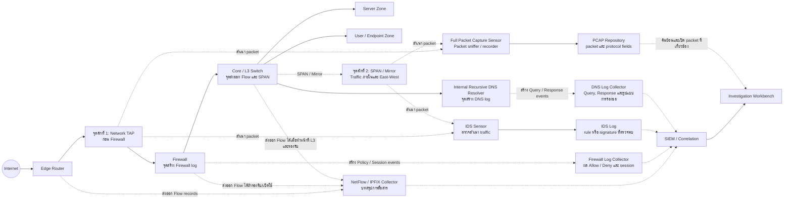

# จาก Network Traffic สู่หลักฐานการสืบสวน

## PCAP, Flow, Security Logs, Correlation และ SIEM สำหรับเครือข่ายขนาดใหญ่

> Network traffic จำนวนมากยังไม่ใช่หลักฐานที่มีความหมาย จนกว่าเราจะตอบได้ว่าข้อมูลมาจากไหน เชื่อมโยงกันอย่างไร และรองรับข้อสรุปใด

## คำนำ

เมื่อเกิดเหตุการณ์ด้านความมั่นคงปลอดภัยไซเบอร์ คำถามแรกมักเป็น “ใครโจมตี” หรือ “ข้อมูลรั่วออกไปหรือไม่” แต่ในงานนิติวิทยาศาสตร์ดิจิทัล เราไม่ควรเริ่มจากข้อสรุป เราควรเริ่มจากหลักฐาน

หลักฐานบนเครือข่ายมีหลายระดับ ตั้งแต่ packet ที่บันทึกรายละเอียดการสื่อสาร Flow ที่สรุปความสัมพันธ์ระหว่างต้นทางกับปลายทาง ไปจนถึง firewall, IDS และ DNS logs ซึ่งแต่ละชนิดมองเห็นเหตุการณ์คนละด้าน ไม่มีแหล่งใดสมบูรณ์ในตัวเอง แนวทางของ NIST จึงให้มองข้อมูลเครือข่ายเป็นส่วนหนึ่งของกระบวนการเก็บรวบรวมโดยรักษาความสมบูรณ์ของหลักฐาน (Collection), การตรวจพิสูจน์โดยยังคงรักษาความสมบูรณ์ (Examination), การวิเคราะห์ (Analysis) และการรายงานผล (Reporting) ไม่ใช่คำตอบสำเร็จรูปของเหตุการณ์ [1], [2]

> **คำอธิบายชื่อขั้นตอน:** NIST SP 800-86 เรียกสี่ phase อย่างเป็นทางการว่า `Collection`, `Examination`, `Analysis` และ `Reporting` ไม่ได้ตั้ง `Preservation` เป็น phase ที่ห้าแยกต่างหาก แต่กำหนดให้การรักษาความสมบูรณ์ของข้อมูลเป็นหน้าที่ภายในทั้ง Collection และ Examination รวมถึงให้พิจารณา chain of custody เมื่อหลักฐานอาจใช้ในกระบวนการทางกฎหมายหรือทางวินัย [1] ส่วน NIST SP 800-61 Rev. 3 กำหนดให้เก็บข้อมูลและ metadata ของ incident พร้อมรักษา integrity และ provenance [2] ในตำราเล่มนี้จึงใช้คำว่า “การเก็บรวบรวมและการรักษาหลักฐาน” เพื่อเน้นหน้าที่ดังกล่าว โดยไม่เปลี่ยนชื่อ phase ทางการของ NIST

หนังสือเล่มนี้เริ่มจากคำถามห้าข้อ

1. เรามีหลักฐานอะไร
2. เราจะเก็บและรักษาความสมบูรณ์ของหลักฐานนั้นอย่างไร
3. หลักฐานแต่ละชนิดบอกอะไรได้และบอกอะไรไม่ได้
4. เราจะเชื่อมหลักฐานเพื่อสร้างลำดับเหตุการณ์ได้อย่างไร
5. เมื่อข้อมูลมีขนาดใหญ่และอยู่ภายใต้ข้อกำหนดกฎหมาย เราจะเก็บ รักษา และวิเคราะห์อย่างรับผิดชอบได้อย่างไร

ตัวอย่างทั้งหมดเป็นสถานการณ์สมมติ ไม่ใช่ production incident และไม่ใช้ข้อมูลที่สามารถระบุตัวบุคคลหรือระบบจริงได้

# บทที่ 1 แหล่งหลักฐานบนเครือข่าย

## 1.1 หลักฐานไม่ใช่เพียงไฟล์ Log

ลองพิจารณาเหตุการณ์สมมติ เครื่องลูกข่าย `10.10.20.15` ติดต่อชื่อโดเมนหนึ่งทุก 60 วินาที หลังจากนั้นส่งข้อมูลออกไปยังปลายทางภายนอกจำนวนมาก และต่อมาพยายามเชื่อมต่อเครื่องภายในหลายเครื่องผ่านบริการ remote administration

ถ้ามีเพียง IDS alert เราอาจเห็น signature match แต่ไม่รู้ว่าการสื่อสารทั้งหมดเกิดขึ้นอย่างไร ถ้ามีเพียง NetFlow เราอาจเห็นจำนวน byte ที่ผิดปกติ แต่ไม่เห็นชื่อโดเมน ถ้ามีเพียง DNS log เราอาจเห็นการติดต่อเป็นคาบ แต่ยังยืนยันไม่ได้ว่ามีข้อมูลรั่วออกไป

หลักฐานแต่ละชนิดจึงเป็น “มุมมอง” ของเหตุการณ์ ไม่ใช่เหตุการณ์ทั้งหมด ภาพต่อไปนี้แสดงทั้งเส้นทาง traffic และจุดที่หลักฐานแต่ละชนิดถูกดักหรือถูกสร้างขึ้น

> **ภาพเชิงสอน ไม่ใช่ deployment standard:** ตำแหน่งจริงขึ้นอยู่กับ topology, routing, NAT, encryption, switch capability และขอบเขตที่ได้รับอนุญาต เส้นทึบคือเส้นทาง traffic ส่วนเส้นประคือการทำสำเนาหรือส่งออก telemetry



จุดในภาพมีความหมายดังนี้

- **PCAP:** Packet sniffer หรือ capture sensor รับสำเนา traffic จาก Network TAP ที่ขอบเครือข่าย หรือจาก SPAN/Mirror ภายใน แล้วบันทึก packet เป็นไฟล์ PCAP ตำแหน่งที่เก็บก่อนหรือหลัง Firewall มีผลต่อ traffic และ address ที่มองเห็น รวมถึงค่า address ก่อนหรือหลัง NAT ตัวดักคือ sniffer/sensor ส่วน PCAP คือหลักฐานผลลัพธ์
- **NetFlow/IPFIX:** ไม่ได้ดัก payload แต่เป็น Flow records ที่อุปกรณ์ซึ่งทำหน้าที่ exporter เช่น router, firewall หรือ L3 switch สร้างและส่งไปยัง collector ความสามารถจริงต้องตรวจจากอุปกรณ์และ configuration
- **Firewall log:** ถูกสร้างที่ Firewall จากการตัดสิน policy และสถานะ session จึงบอกสิ่งที่ Firewall เห็นและตัดสิน ณ จุดนั้น
- **IDS log:** เกิดจาก IDS sensor ที่ตรวจสำเนา traffic จาก TAP/SPAN การเห็น signature match ขึ้นอยู่กับตำแหน่ง sensor, rule set, packet loss และสิ่งที่มองเห็นภายใต้การเข้ารหัส
- **DNS log:** ถูกสร้างที่ Internal Recursive DNS Resolver ซึ่งรับ Query จากเครื่องลูกข่ายภายในและคืน Response จึงเห็นเฉพาะคำขอที่ผ่านแหล่งนั้น ส่วน log จาก authoritative DNS server ให้มุมมองคนละจุด การใช้ external DNS, encrypted DNS หรือ resolver อื่นอาจทำให้ข้อมูลไม่ครบ [5], [6]

SIEM ในภาพรับ Flow records และ logs/alerts เพื่อ correlation ส่วน full PCAP มักถูกเก็บในระบบ packet repository แล้วให้ผู้วิเคราะห์ค้นย้อนจากเวลา address, port หรือหลักฐานอ้างอิง การส่ง full PCAP ทั้งหมดเข้า SIEM ไม่ใช่ข้อกำหนดทั่วไป

## 1.2 PCAP

ไฟล์ PCAP หรือชุดข้อมูล packet capture เป็นหลักฐานที่บันทึก packet ซึ่ง packet sniffer หรือ capture sensor เก็บจากจุดตรวจจับในช่วงเวลาหนึ่ง ผู้วิเคราะห์สามารถตรวจ address, port, protocol header, flag, sequence และ payload ได้เท่าที่การเข้ารหัส ตำแหน่งการดักจับ และความครบถ้วนของการเก็บข้อมูลอนุญาต [1], [15]

PCAP เหมาะกับคำถาม เช่น

- เครื่องใดเริ่มการเชื่อมต่อ
- ใช้ protocol และ port ใด
- TCP handshake สำเร็จหรือไม่
- ส่งข้อมูลในทิศทางใด
- DNS query และ response เป็นอะไร
- packet ที่ IDS แจ้งเตือนมีลักษณะอย่างไร

แต่ PCAP ไม่ได้ทำให้เราเห็นทุกสิ่ง การเข้ารหัสอาจทำให้มองไม่เห็นเนื้อหา จุดดักจับอาจไม่ครอบคลุมเส้นทาง packet อาจตกหล่น และการเก็บ packet ทั้งหมดในเครือข่ายขนาดใหญ่อาจใช้พื้นที่สูงมาก ข้อกล่าวอ้างที่เหมาะสมจึงเป็น “PCAP แสดง traffic ที่ผ่านจุดดักจับและถูกบันทึกไว้” ไม่ใช่ “PCAP แสดงการสื่อสารทั้งหมด”

## 1.3 NetFlow และ IPFIX

ข้อมูล Flow ไม่ได้เก็บ packet ทุกตัว แต่เก็บบทสรุปของการสื่อสาร เช่น ต้นทาง ปลายทาง port, protocol, เวลา จำนวน packet และจำนวน byte ขอบเขต field ที่มีจริงขึ้นอยู่กับ exporter, protocol version, template และ configuration [7], [8]

Flow เหมาะกับการค้นหา pattern ในข้อมูลปริมาณมาก เช่น เครื่องใดส่งข้อมูลออกสูงผิดปกติ ติดต่อปลายทางจำนวนมาก หรือมีการเชื่อมต่อ east-west เพิ่มขึ้น ข้อดีคือใช้พื้นที่น้อยกว่า PCAP ส่วนข้อจำกัดคือไม่เห็น payload และอาจสูญเสียรายละเอียดจาก sampling หรือ aggregation

## 1.4 Firewall Logs

Firewall log บันทึกสิ่งที่อุปกรณ์ควบคุมเครือข่ายมองเห็น เช่น session, source, destination, port, action, policy และปริมาณข้อมูล คำว่า `allow` หมายความว่า firewall อนุญาตตาม policy ณ จุดนั้น ไม่ได้หมายความว่า traffic ปลอดภัย ส่วน `deny` แสดงว่ามี traffic ตรงกับเงื่อนไขปฏิเสธ แต่ยังไม่พิสูจน์ว่าผู้โจมตีเข้าถึงระบบสำเร็จ

เมื่อวิเคราะห์ firewall log ต้องตรวจอย่างน้อยว่า log มาจากอุปกรณ์และ interface ใด address ถูกแปลงด้วย NAT แล้วหรือยัง timestamp ใช้เขตเวลาใด policy ใดเป็นผู้ตัดสิน และ session ถูกปิดตามปกติหรือไม่ [1], [3]

## 1.5 IDS Logs

Intrusion Detection System ตรวจ traffic ด้วย signature, rule หรือพฤติกรรมที่กำหนด ผลลัพธ์จึงเป็น “สิ่งที่กฎตรวจพบ” ไม่ใช่คำยืนยันว่าเกิด incident แล้ว

```text
Rule match
   != Confirmed attack
   != Successful compromise
   != Confirmed incident
```

IDS alert ต้องถูกตรวจร่วมกับ packet, flow, firewall และหลักฐานจากเครื่องปลายทาง หากพบ signature แต่ไม่มีการเชื่อมต่อสำเร็จ อาจเป็นเพียงความพยายาม และหาก rule กว้างเกินไปก็อาจเป็น false positive [1], [2], [18]

## 1.6 DNS Logs

DNS log ช่วยตอบว่าเครื่องใดถามชื่อใด เมื่อใด ได้คำตอบอะไร และถามซ้ำในรูปแบบใด โครงสร้างของระบบชื่อโดเมนและข้อความ DNS กำหนดไว้ใน RFC 1034 และ RFC 1035 [5], [6]

DNS log จึงมีประโยชน์ต่อการตรวจ beaconing, domain-generation pattern หรือ DNS tunneling แต่ query ที่ดูผิดปกติไม่ได้ยืนยันว่าเป็น C2 เสมอ โปรแกรมตรวจสุขภาพระบบ บริการอัปเดต และ telemetry ที่ถูกต้องก็อาจสร้าง traffic เป็นคาบได้

> หลักฐานหนึ่งรายการอาจทำให้เราตั้งข้อสงสัย แต่การยืนยันต้องอาศัยบริบทและหลักฐานที่สอดคล้องกัน

## 1.7 Preservation เป็นหน้าที่ตลอดสายหลักฐาน

การรักษาหลักฐาน (Preservation) ไม่ควรเริ่มหลังวิเคราะห์เสร็จ เพราะการเปลี่ยนแปลงสามารถเกิดขึ้นตั้งแต่การตั้งค่า capture, การ export log, การส่งผ่าน collector, การ normalize และการเปิดไฟล์ด้วยเครื่องมือวิเคราะห์ กระบวนการจึงต้องระบุตัวแหล่งข้อมูล บันทึกเวลาและวิธีการเก็บ จำกัดการเข้าถึง เก็บต้นฉบับหรือสำเนาที่ตรวจสอบได้ คำนวณค่าตรวจสอบความสมบูรณ์เมื่อเหมาะสม และบันทึกการส่งต่อ [1], [2], [4]

การเก็บ network evidence มีข้อจำกัดต่างจาก disk image เพราะ traffic และหลายระบบ log เป็นข้อมูลที่เกิดและเปลี่ยนต่อเนื่อง ผู้ตรวจจึงต้องบันทึกทั้งขอบเขตที่เก็บได้และสิ่งที่ไม่ได้เก็บ เช่น จุดดักจับ ช่วงเวลา packet loss, sampling, filter, rollover และ retention การ preservation ที่ดีไม่ได้ทำให้หลักฐานสมบูรณ์ขึ้นย้อนหลัง แต่ทำให้เราพิสูจน์ได้ว่าหลักฐานที่มีถูกจัดการอย่างไร

## 1.8 อุปกรณ์เป็นทางผ่านหรือผู้ตรวจจับ ต้องทำ Disk Image หรือไม่

คำตอบสั้นที่สุดคือ **ไม่จำเป็นต้องถอดดิสก์หรือทำ full-disk image ทุกเครื่อง เพียงเพราะ firewall, router หรือ IDS เป็นทางผ่านหรือสร้าง log ที่เกี่ยวข้อง** แต่ต้องรีบสงวนหลักฐานที่เกี่ยวข้องจากอุปกรณ์นั้นก่อน log หมุนทับหรือสถานะที่เปลี่ยนแปลงเร็วสูญหาย การที่อุปกรณ์บันทึกเหตุการณ์ไม่ได้แปลว่าอุปกรณ์ถูกบุกรุก และการที่อุปกรณ์ไม่ถูกบุกรุกก็ไม่ได้ทำให้ข้อมูลในอุปกรณ์หมดคุณค่า [1], [3]

เพื่อช่วยกำหนดขอบเขตการเก็บหลักฐาน ผู้ตรวจสอบอาจพิจารณาบทบาทของอุปกรณ์เป็นกรอบวิเคราะห์ ดังนี้

1. **แหล่งข้อมูลที่บันทึกเหตุการณ์:** อุปกรณ์เห็น traffic ตัดสิน policy หรือแจ้งเตือน แต่ยังไม่มีหลักฐานว่าตัวอุปกรณ์ถูกบุกรุก
2. **ระบบที่เกี่ยวข้องหรือได้รับผลกระทบ:** configuration, account, firmware หรือการทำงานของอุปกรณ์อาจเปลี่ยนไปจากเหตุการณ์
3. **ระบบที่มีเหตุสงสัยว่าถูกใช้ในการกระทำความผิด:** อุปกรณ์อาจถูกควบคุม ใช้ส่งต่อ traffic หรือใช้เป็นจุด pivot เพื่อเข้าสู่ระบบอื่น

> **กรอบสังเคราะห์ ไม่ใช่ taxonomy ของ NIST หรือคำจำแนกตามกฎหมาย:** การแบ่งสามบทบาทข้างต้นเป็นกรอบอธิบายของตำราเพื่อช่วยตั้งคำถามเรื่องขอบเขตการเก็บหลักฐาน NIST SP 800-86 ระบุ firewall, router และ IDS เป็นแหล่งข้อมูลสำหรับ network forensics ส่วนถ้อยคำ “เกี่ยวข้องหรือได้รับผลกระทบ” ปรากฏในพระราชบัญญัติการรักษาความมั่นคงปลอดภัยไซเบอร์ มาตรา 65–66 แต่ NIST และกฎหมายไม่ได้บัญญัติการจำแนกสามข้อข้างต้นไว้โดยตรง [1], [10]

บทบาทข้อ 2 และข้อ 3 มักเพิ่มเหตุผลให้ตรวจเก็บข้อมูลระดับระบบหรือสื่อบันทึก แต่ห้ามสรุปว่าเฉพาะสองข้อนี้เท่านั้นที่ควรทำ image แม้อุปกรณ์อยู่ในข้อ 1 ก็อาจต้องทำ image หากหลักฐานมีอยู่เฉพาะในอุปกรณ์ กำลังถูกเขียนทับ ต้องค้นหาข้อมูลที่ลบไปแล้ว หรือคาดว่าจะใช้ตัวสื่อบันทึกเป็นหลักฐานในกระบวนการคดีหรือทางวินัย [1]

### ขอบเขตตามกฎหมายไทย

พระราชบัญญัติว่าด้วยการกระทำความผิดเกี่ยวกับคอมพิวเตอร์ไม่ได้กำหนดว่า เมื่อพบ log ที่เกี่ยวข้องแล้วต้องทำ image ทั้งดิสก์เสมอไป มาตรา 18 แยกการเรียกข้อมูลจราจร การสั่งให้เก็บข้อมูลไว้ก่อน การทำสำเนาข้อมูล การตรวจสอบหรือเข้าถึงระบบ และการยึดหรืออายัดระบบออกจากกัน การยึดหรืออายัดตามมาตรา 18 (8) ต้องทำเท่าที่จำเป็น และการใช้อำนาจตามมาตรา 18 (4)–(8) ต้องดำเนินการภายใต้คำสั่งศาลตามมาตรา 19 [9]

> **คำคัดจาก พ.ร.บ.คอมพิวเตอร์:** มาตรา 18 (4) ใช้คำว่า “ทำสำเนาข้อมูลคอมพิวเตอร์ ข้อมูลจราจรทางคอมพิวเตอร์” ขณะที่มาตรา 18 (8) ใช้คำว่า “ยึดหรืออายัดระบบคอมพิวเตอร์เท่าที่จำเป็น” และมาตรา 19 กำหนดให้ “ยื่นคำร้องต่อศาลที่มีเขตอำนาจเพื่อมีคำสั่งอนุญาต” [9]

มาตรา 26 กำหนดให้ผู้ที่เข้าองค์ประกอบเป็นผู้ให้บริการเก็บข้อมูลจราจรทางคอมพิวเตอร์ไม่น้อยกว่า 90 วัน และในกรณีจำเป็นพนักงานเจ้าหน้าที่อาจสั่งเป็นกรณีพิเศษเฉพาะรายและเฉพาะคราวให้เก็บเกิน 90 วันแต่ไม่เกินสองปี ข้อกำหนดนี้ไม่ได้ทำให้ข้อมูลจราจรมีความหมายเท่ากับ full-disk image และไม่ได้ทำให้ firewall ทุกเครื่องกลายเป็นผู้ให้บริการโดยอัตโนมัติ ต้องตรวจนิยาม ประเภทผู้ให้บริการ และประกาศที่ใช้บังคับกับหน่วยงานนั้น [9]

> **คำคัดจากมาตรา 26:** “ผู้ให้บริการต้องเก็บรักษาข้อมูลจราจรทางคอมพิวเตอร์ไว้ไม่น้อยกว่าเก้าสิบวัน” และในกรณีจำเป็นอาจถูกสั่งให้เก็บ “เกินเก้าสิบวันแต่ไม่เกินสองปีเป็นกรณีพิเศษเฉพาะรายและเฉพาะคราว” โดยประเภท วิธีการ และเวลาที่ใช้บังคับเป็นไปตามประกาศของรัฐมนตรี [9]

สำหรับหน่วยงานโครงสร้างพื้นฐานสำคัญทางสารสนเทศ มาตรา 58 แห่งพระราชบัญญัติการรักษาความมั่นคงปลอดภัยไซเบอร์ให้ตรวจสอบข้อมูลที่เกี่ยวข้อง ข้อมูลคอมพิวเตอร์ ระบบคอมพิวเตอร์ และพฤติการณ์แวดล้อมเพื่อประเมินภัยคุกคาม ไม่ได้บังคับให้ image ทุกระบบ มาตรา 65 (4) กล่าวถึงการรักษาสถานะของข้อมูลหรือระบบด้วยวิธีการใด ๆ เพื่อดำเนินการทางนิติวิทยาศาสตร์ทางคอมพิวเตอร์ในบริบทภัยคุกคามระดับร้ายแรงและการใช้อำนาจเท่าที่จำเป็น ส่วนมาตรา 66 แยกการทำสำเนาหรือสกัดคัดกรองข้อมูลออกจากการยึดหรืออายัดอุปกรณ์ และกำหนดกระบวนการขอคำสั่งศาลสำหรับการดำเนินการตามมาตรา 66 (2)–(4) [10]

> **คำคัดจาก พ.ร.บ.การรักษาความมั่นคงปลอดภัยไซเบอร์:** มาตรา 58 กำหนดให้ “ตรวจสอบข้อมูลที่เกี่ยวข้อง ข้อมูลคอมพิวเตอร์ และระบบคอมพิวเตอร์ของหน่วยงานนั้น รวมถึงพฤติการณ์แวดล้อมของตน” มาตรา 65 (4) ระบุว่า “รักษาสถานะของข้อมูลคอมพิวเตอร์หรือระบบคอมพิวเตอร์ด้วยวิธีการใด ๆ เพื่อดำเนินการทางนิติวิทยาศาสตร์ทางคอมพิวเตอร์” ส่วนมาตรา 66 แยกคำว่า “ทำสำเนา หรือสกัดคัดกรองข้อมูล” ใน (2) ออกจาก “ยึดหรืออายัด” ใน (4) และกำกับด้วยคำว่า “เฉพาะเท่าที่จำเป็น” [10]

ประมวลแนวปฏิบัติของ กสทช. สำหรับ CII ด้านเทคโนโลยีสารสนเทศและโทรคมนาคมกำหนดให้จัดเก็บบันทึกเหตุการณ์อย่างปลอดภัยอย่างน้อย 90 วันหรือตามกฎหมายที่เกี่ยวข้อง และให้มีกระบวนการตรวจพิสูจน์พยานหลักฐานทางดิจิทัล แต่ไม่ได้กำหนดให้ image อุปกรณ์ทุกตัวเมื่อเกิดเหตุ [14]

> **คำคัดจากประมวลแนวปฏิบัติ กสทช.:** ข้อ 2.2 (3) กำหนดว่า “ต้องมีการจัดเก็บบันทึกเหตุการณ์ (Logs) ... อย่างน้อย 90 วัน หรือตามกฎหมายที่เกี่ยวข้องกำหนดด้วยวิธีการที่ปลอดภัย” และข้อ 2.3 (1) ให้แนวทางรับมือเหตุครอบคลุม “การตรวจพิสูจน์พยานหลักฐานทางดิจิทัล (Digital Forensics)” [14]

อำนาจยึดหรืออายัดตามกฎหมายข้างต้นเป็นอำนาจของพนักงานเจ้าหน้าที่หรือองค์กรที่กฎหมายระบุ ภายใต้เงื่อนไขและกระบวนการที่กำหนด ไม่ใช่อำนาจทั่วไปของทีม incident response เอกชนเหนืออุปกรณ์ของบุคคลที่สาม หากองค์กรเก็บข้อมูลจากอุปกรณ์ของตนเอง ต้องมี authorization และปฏิบัติตามนโยบาย ส่วนอุปกรณ์ของผู้ให้บริการหรือบุคคลอื่นต้องพิจารณาสัญญา ความยินยอม คำสั่งของผู้มีอำนาจ และกระบวนการทางกฎหมายที่เกี่ยวข้อง

> **ถ้อยคำที่ระบุผู้ใช้อำนาจ:** มาตรา 19 แห่ง พ.ร.บ.คอมพิวเตอร์ใช้ข้อความว่า “ให้พนักงานเจ้าหน้าที่ยื่นคำร้องต่อศาล” ส่วนมาตรา 66 แห่ง พ.ร.บ.การรักษาความมั่นคงปลอดภัยไซเบอร์ใช้ข้อความว่า “ให้ กกม. ยื่นคำร้องต่อศาล” [9], [10]

### หลักตัดสินใจตาม NIST

NIST SP 800-86 ให้เริ่มจากการระบุแหล่งข้อมูล วางแผน acquisition เก็บข้อมูล และตรวจสอบความสมบูรณ์ของข้อมูล แผนควรจัดลำดับแหล่งข้อมูลตามคุณค่าที่คาดว่าจะได้รับ ความผันผวนของข้อมูล และความพยายามที่ต้องใช้ พร้อมพิจารณาแหล่งข้อมูลทดแทนเมื่อเก็บจากแหล่งหลักไม่ได้ [1]

ดังนั้น หาก firewall หรือ IDS ไม่มีข้อบ่งชี้ว่าถูกบุกรุกและส่ง log ที่ครบถ้วนไปยัง SIEM หรือ log server แล้ว วิธีที่เหมาะสมมักเริ่มจาก **logical acquisition หรือ logical backup โดยรักษาความสมบูรณ์ของข้อมูลที่เกี่ยวข้อง** ไม่ใช่การถอดดิสก์ทันที การตัดสินใจยังต้องพิจารณาว่าสำเนากลางเก็บ field ครบหรือไม่ มีการ normalize หรือตัดทอนข้อมูลหรือไม่ และข้อมูลต้นทางกำลังจะถูกหมุนทับหรือไม่ [1], [3]

รายการต่อไปนี้เป็นตัวอย่างการนำหลักของ NIST มาประยุกต์กับอุปกรณ์เครือข่าย ไม่ใช่ลำดับบังคับสากล:

1. บันทึกเวลาของอุปกรณ์ timezone แหล่ง NTP และความคลาดเคลื่อนของนาฬิกา
2. เก็บข้อมูลที่อาจสูญหายเมื่อปิดเครื่องก่อน เช่น session table, NAT mapping, ARP table, routing table, HA state, alert queue และ packet ring buffer เท่าที่อุปกรณ์มีและขอบเขตอนุญาต
3. Export log ในรูปแบบต้นทาง โดยครอบคลุมช่วงก่อน ระหว่าง และหลังเหตุการณ์
4. Export running configuration, startup configuration, policy, rule หรือ signature version, firmware version และประวัติการเปลี่ยน configuration ที่เกี่ยวข้อง
5. เก็บสำเนาจาก SIEM, syslog manager หรือระบบจัดเก็บกลางเพื่อเปรียบเทียบกับข้อมูลในอุปกรณ์
6. บันทึกเครื่องมือ คำสั่ง ผู้เก็บ เวลา ผลกระทบที่อาจเกิดจากการเก็บ และคำนวณ hash ของไฟล์ที่ export เมื่อเหมาะสม
7. ป้องกัน log rotation หรือกำหนด preservation hold โดยควบคุมและบันทึกการเปลี่ยนแปลงที่จำเป็น

ควรพิจารณายกระดับไปสู่ bit-stream image หรือวิธี acquisition ที่ให้ขอบเขตใกล้เคียง เมื่อพบเงื่อนไขอย่างน้อยหนึ่งข้อ เช่น

- firmware, operating system, administrator account หรือ configuration มีความผิดปกติ
- log ในอุปกรณ์ขัดแย้งกับ log กลาง มีช่วงขาดหาย หรือมีเหตุสงสัยว่าถูกแก้ไข
- หลักฐานสำคัญมีอยู่เฉพาะใน local storage และกำลังจะถูกหมุนทับ
- ต้องค้นหา deleted files, slack space, malware หรือร่องรอย persistence
- คาดว่าจะใช้ในคดีหรือกระบวนการทางวินัย และตัวสื่อบันทึกมีคุณค่าเป็นหลักฐาน
- เจ้าหน้าที่หรือศาลมีคำสั่งให้รักษาสถานะ ทำสำเนา ยึด หรืออายัดอุปกรณ์

NIST SP 800-86 อธิบายว่า logical backup เก็บไฟล์และไดเรกทอรีใน logical volume แต่ bit-stream image เก็บสำเนาระดับบิตรวมถึง free space และ slack space หากคาดว่าจะใช้หลักฐานในการดำเนินคดีหรือทางวินัย NIST แนะนำให้เก็บ bit-stream image ของสื่อต้นฉบับ เก็บต้นฉบับไว้อย่างปลอดภัย วิเคราะห์บนสำเนา บันทึกทุกขั้นตอน และตรวจสอบความสมบูรณ์ของสำเนา [1]

การทำ **bit-stream image ไม่ได้หมายความว่าต้องถอดดิสก์เสมอไป** ผู้ตรวจสอบอาจถอดดิสก์แล้วเชื่อมต่อผ่าน write blocker หรือเก็บข้อมูลโดยไม่ถอดดิสก์ด้วย trusted boot media, forensic acquisition software หรือ remote acquisition ก็ได้ ตัวอย่างเช่น Magnet AXIOM Cyber สามารถเก็บข้อมูลจากเครื่องปลายทางระยะไกลได้ โดยคู่มือระบุว่าสำหรับ Windows การเลือก `Drives` สามารถเก็บ complete drive เป็น raw binary แบบ byte-for-byte ส่วนการเลือก files and folders เป็น logical image ดังนั้น การใช้ AXIOM ไม่ได้ทำให้ผลลัพธ์เป็น bit-stream image โดยอัตโนมัติ ผู้ตรวจสอบต้องตรวจ acquisition option, ระบบปฏิบัติการ การเข้ารหัส สิทธิ์เข้าถึง และผลลัพธ์จริง พร้อมบันทึกวิธีการ ค่า hash สถานะของระบบ และข้อจำกัดจากการเก็บข้อมูลขณะระบบยังทำงานอยู่ [1], [22]

> **จำง่าย:** “ถอดดิสก์” คือวิธีเข้าถึงสื่อ ส่วน “bit-stream image” คือชนิดของสำเนาที่สร้างขึ้น สองคำนี้จึงไม่ใช่ความหมายเดียวกัน

ตัวอย่าง Magnet AXIOM Cyber ข้างต้นใช้กับเครื่องปลายทางและระบบปฏิบัติการที่ผลิตภัณฑ์รองรับ ไม่ได้ยืนยันว่าเครื่องมือนี้สามารถทำ physical acquisition จาก firewall, router หรือ IDS ทุกยี่ห้อ อุปกรณ์เครือข่ายต้องตรวจความสามารถของผู้ผลิต สถาปัตยกรรม storage และวิธี acquisition ที่ได้รับอนุญาตเป็นรายกรณี

สำหรับ firewall, router หรือ IDS ที่รองรับบริการสำคัญ **ไม่ควรถอดดิสก์จากเครื่องที่กำลังทำงานเป็นขั้นตอนแรก** เพราะอาจทำให้บริการหยุดและทำให้ volatile data สูญหาย ควรเก็บ live state ที่จำเป็นก่อน ประเมินการทำ failover ตามแผนที่ได้รับอนุมัติ แล้วเลือกวิธีที่สถาปัตยกรรมของอุปกรณ์รองรับ เช่น native log export, forensic export, diagnostic bundle, snapshot ของ virtual appliance หรือ bit-stream image ผ่าน write blocker เมื่อสามารถเข้าถึงสื่อบันทึกได้อย่างถูกต้อง วิธีที่เลือกต้องบันทึกข้อจำกัดและการเปลี่ยนแปลงที่ acquisition ก่อขึ้น [1]

หลักจำของหัวข้อนี้คือ หากอุปกรณ์ทำหน้าที่เป็นแหล่งข้อมูล ให้เก็บสิ่งที่อุปกรณ์เห็นพร้อม provenance หากมีเหตุว่าอุปกรณ์ได้รับผลกระทบหรือถูกใช้ในการกระทำความผิด ให้พิจารณาเก็บทั้งสถานะและตัวสื่อบันทึก แต่ทุกกรณีต้องใช้ขอบเขตเท่าที่จำเป็น รักษาหลักฐานที่สูญหายง่ายก่อน และไม่ทำลายความต่อเนื่องของบริการโดยไม่มีเหตุรองรับ

# บทที่ 2 การวิเคราะห์ Traffic เพื่อค้นหาการโจมตี

## 2.1 จาก Indicator ไปสู่พฤติกรรม

การค้นหา IP address หรือ domain ที่อยู่ในรายการต้องสงสัยมีประโยชน์ แต่ไม่เพียงพอ เพราะโครงสร้างพื้นฐานของผู้โจมตีเปลี่ยนได้ และข้อมูล reputation อาจล้าสมัย การวิเคราะห์ควรมองพฤติกรรมร่วมด้วย เช่น การติดต่อเป็นคาบ การส่งข้อมูลออกเพิ่มจาก baseline การเชื่อมต่อบริการ remote administration ไปยังหลายเครื่อง หรือเหตุการณ์หลายชนิดที่เกิดต่อเนื่องในช่วงเวลาเดียวกัน [2], [18], [20]

## 2.2 Command and Control

Command and Control หรือ C2 คือช่องทางที่ผู้โจมตีใช้ควบคุมระบบที่ถูกบุกรุก พฤติกรรมที่อาจสนับสนุนสมมติฐาน C2 ได้แก่

- ติดต่อปลายทางเดิมเป็นช่วงเวลาคงที่
- ส่งข้อมูลขนาดเล็กซ้ำ ๆ
- ติดต่อชื่อโดเมนที่พบเฉพาะเครื่องเดียว
- ใช้ protocol ปกติแต่มี pattern ไม่สอดคล้องกับบทบาทของระบบ

ตัวอย่าง:

```text
Host: 10.10.20.15
Query: update-control.example
ช่วงเวลา: ทุกประมาณ 60 วินาที
จำนวนครั้ง: 240 ครั้ง
เครื่องอื่นที่ถามชื่อเดียวกัน: 0
```

ข้อมูลนี้รองรับข้อสังเกตว่า “มี periodic DNS behavior ที่ควรตรวจสอบ” แต่ยังไม่พอให้สรุปว่าเครื่องถูกควบคุมผ่าน C2 ผู้วิเคราะห์ควรหาหลักฐานเพิ่ม เช่น connection หลัง DNS response, endpoint process, authentication event และการเปลี่ยนแปลงบนเครื่อง [1], [2], [18]

## 2.3 Data Exfiltration

Data exfiltration คือการนำข้อมูลออกจากขอบเขตที่ได้รับอนุญาต สัญญาณที่อาจตรวจจาก Flow หรือ firewall log ได้แก่ outbound bytes สูงกว่า baseline การส่งข้อมูลในเวลาที่ไม่สอดคล้องกับการใช้งาน ปลายทางไม่เคยพบมาก่อน หรือสัดส่วนข้อมูลขาออกต่อขาเข้าสูงผิดปกติ [18], [20]

ถ้า NetFlow แสดงว่าเครื่องหนึ่งส่งข้อมูลออก 620 MB ภายใน 15 นาที เรากล่าวได้ว่า “พบ outbound transfer เกิน threshold ที่กำหนด” แต่ยังไม่ควรกล่าวว่า “ข้อมูลลับถูกขโมย 620 MB” เพราะ Flow ไม่ได้บอกเนื้อหาภายใน ปริมาณดังกล่าวอาจเป็น backup, software distribution หรือกิจกรรมที่ได้รับอนุญาต

## 2.4 Lateral Movement

Lateral movement คือการที่ผู้โจมตีเข้าถึงเครื่องหรือบัญชีหนึ่งได้แล้ว และใช้สิทธิ์หรือข้อมูลจากจุดนั้นเพื่อเข้าถึงเครื่อง บัญชี หรือบริการอื่นต่อภายในองค์กร สัญญาณที่ควรตรวจสอบ ได้แก่ เครื่องผู้ใช้เชื่อมต่อหลายระบบด้วยบริการ remote administration, จำนวนปลายทางเพิ่มเร็ว, authentication failures ตามด้วย success หรือ account เดียวกันถูกใช้ข้ามหลายระบบ [2], [18], [19]

Connection log ช่วยค้น remote-service fan-out ได้ แต่เพียงอย่างเดียวอาจไม่เห็นว่า authentication สำเร็จหรือ process ใดเป็นผู้เริ่ม ผู้วิเคราะห์จึงต้องผูกกับ authentication และ endpoint logs

## 2.5 ลำดับเหตุการณ์และระดับคำกล่าวอ้าง

```text
09:10  เครื่อง A เริ่ม DNS periodic behavior
09:25  เครื่อง A เชื่อมต่อปลายทางภายนอก
09:31  Outbound bytes เพิ่มสูง
09:48  เครื่อง A ติดต่อ SMB/RDP ไปยังหลายเครื่อง
10:02  IDS พบ signature ที่เกี่ยวข้อง
```

ลำดับนี้สนับสนุนสมมติฐาน C2 ตามด้วย exfiltration และ lateral movement แต่ยังต้องตรวจ provenance, clock alignment และตัวตนของ asset ก่อนสรุปว่าเป็น incident เดียวกัน ระดับคำกล่าวอ้างต้องไม่เกินระดับหลักฐานที่มี [1], [2]

# บทที่ 3 Log Correlation และการใช้ SIEM ช่วยสืบสวน

## 3.1 Correlation ไม่ใช่การนำ Log มากองรวมกัน

การนำ logs มาเก็บในระบบเดียวคือ collection หรือ centralization ส่วน correlation ต้องสร้างความสัมพันธ์ที่ตรวจสอบได้ โดยพิจารณาอย่างน้อยสี่แกน

> **กรอบสอน ไม่ใช่มาตรฐาน:** การแบ่งเป็น Entity, Time, Activity และ Provenance ต่อไปนี้เป็นกรอบตรวจความพร้อมของข้อมูลสำหรับกรณีศึกษาในเล่ม ไม่ใช่อนุกรมวิธานหรือจำนวนแกนบังคับจาก NIST

- **Entity** เช่น IP, hostname, user, session หรือ device
- **Time** รวม timezone, clock offset และ time window
- **Activity** เช่น DNS, connection, alert หรือ authentication
- **Provenance** เช่น source record, collector และ transformation

DNS log กับ firewall log อาจมี IP เดียวกัน แต่ถ้า DHCP จัดสรร IP นั้นให้คนละเครื่องในคนละเวลา การ join ด้วย IP เพียงอย่างเดียวอาจเชื่อมเหตุการณ์ผิด [2], [3], [19]

## 3.2 Normalize ก่อน Correlate

แต่ละผลิตภัณฑ์ใช้ชื่อ field และรูปแบบเวลาไม่เหมือนกัน ระบบจึงมักแปลงข้อมูลเข้าสู่ canonical schema เช่น

> **ตัวอย่าง ไม่ใช่ schema มาตรฐาน:** รายการ field ต่อไปนี้ใช้แสดงแนวคิดของการ normalize เท่านั้น ระบบจริงต้องกำหนด schema, semantics, data type และ provenance contract จากแหล่งข้อมูลและข้อกำหนดของโครงการ

```text
event_time
source_ip
destination_ip
source_port
destination_port
protocol
event_type
action
bytes_sent
bytes_received
source_record_id
```

Normalization ต้องไม่ทำลายหรือแทนที่ข้อมูลต้นฉบับ ผู้ตรวจต้องย้อนจาก normalized record ไปยัง raw evidence ทราบ parser หรือ transformation version และตรวจความสัมพันธ์ระหว่าง input กับ output ได้ [1], [3], [4] การรักษา raw evidence กับการเก็บ normalized data จึงเป็นคนละหน้าที่: raw evidence รองรับการตรวจย้อนกลับ ส่วน normalized data รองรับการค้นและ correlation

## 3.3 SIEM ช่วยอะไร

SIEM ช่วยรับข้อมูลจากหลายแหล่ง จัดรูปแบบ เพิ่มบริบท ค้นหา aggregate ประเมิน correlation rule สร้าง alert และจัด timeline เพื่อส่งต่อให้ผู้วิเคราะห์ อย่างไรก็ตาม SIEM ไม่ทำให้ข้อมูลต้นทางถูกต้องโดยอัตโนมัติ หาก timestamp ผิด parser map field ผิด หรือ log source ขาดหาย ผล correlation อาจดูสอดคล้องแต่ผิดจากเหตุการณ์จริง [2], [3]

## 3.4 Teaching SIEM กับ Production SIEM

Repository `agentic-security-log-analytics` มี collection, normalization, Spark analytics, detection, correlation, timeline และ investigation handoff พร้อมกรณี C2, exfiltration และ lateral movement แต่ repository ระบุว่าเป็น Lab/prototype ใช้ synthetic data และไม่ใช่ production deployment [21]

Production SIEM ยังต้องพิจารณา authentication, authorization, continuous ingestion, late-arriving events, retention, deletion, monitoring, failure recovery, case lifecycle, audit trail และการควบคุมการเข้าถึงหลักฐาน การที่ Lab ผ่าน acceptance test จึงพิสูจน์ workflow ภายใต้ข้อมูลและเงื่อนไขที่กำหนด ไม่ได้พิสูจน์ detection efficacy หรือ production scalability ทุกสภาพแวดล้อม

# บทที่ 4 ความท้าทายเฉพาะของเครือข่ายโทรคมนาคมขนาดใหญ่

## 4.1 ปริมาณข้อมูลไม่ใช่ปัญหาเดียว

เครือข่ายโทรคมนาคมขนาดใหญ่มีทั้งปริมาณ ความเร็ว ความหลากหลาย และความไม่สมบูรณ์ของข้อมูล

> **กรอบอธิบาย ไม่ใช่ข้อกำหนดทางกฎหมายหรือมาตรฐาน:** Volume, Velocity, Variety และ Veracity ใช้จัดกลุ่มปัญหาเพื่อการสอนในบทนี้ ไม่ได้หมายความว่าการผ่านสี่หัวข้อนี้ทำให้ระบบพร้อมใช้งานหรือเป็นไปตามกฎหมายแล้ว

```text
Volume      ปริมาณ packet, flow และ log
Velocity    ข้อมูลไหลเข้าต่อเนื่องและต้องประมวลผลทันเวลา
Variety     อุปกรณ์ ผู้ผลิต protocol และ schema แตกต่างกัน
Veracity    เวลา ตัวตน และ record อาจไม่ครบหรือคลาดเคลื่อน
```

การทดสอบ 100,000 records ช่วยพิสูจน์ logic ในขอบเขตหนึ่ง แต่ไม่เท่ากับ production-scale validation ต้องทดสอบ throughput, latency, loss, backpressure, storage growth และ recovery ภายใต้ workload ที่เป็นตัวแทนระบบจริง [3], [20], [21]

## 4.2 เวลาเป็นแกนของการสืบสวน

ถ้าอุปกรณ์แต่ละตัวมีเวลาไม่ตรงกัน ลำดับเหตุการณ์อาจกลับด้านได้ ระบบจึงควรเก็บ timestamp จากต้นทาง timezone เวลาที่ collector รับข้อมูล สถานะ time synchronization และการปรับเวลาในขั้นตอน normalization แนวทาง NIST SP 800-92 ให้มอง log management เป็นกระบวนการระดับองค์กร ไม่ใช่เพียงเปิด logging บนอุปกรณ์แต่ละตัว [3]

## 4.3 Retention ต้องเริ่มจากกฎหมายและวัตถุประสงค์

การเก็บทุกอย่างตลอดไปไม่ใช่คำตอบ เพราะเพิ่มค่าใช้จ่าย ความเสี่ยงต่อข้อมูลส่วนบุคคล และขอบเขตความเสียหายหากระบบจัดเก็บถูกเข้าถึง

มาตรา 26 แห่งพระราชบัญญัติว่าด้วยการกระทำความผิดเกี่ยวกับคอมพิวเตอร์กำหนดให้ผู้ให้บริการเก็บรักษาข้อมูลจราจรทางคอมพิวเตอร์ไม่น้อยกว่า 90 วันนับแต่วันที่ข้อมูลเข้าสู่ระบบ และในกรณีจำเป็น พนักงานเจ้าหน้าที่อาจสั่งให้เก็บเกิน 90 วันแต่ไม่เกินสองปีเป็นกรณีพิเศษเฉพาะรายและเฉพาะคราว [9]

ข้อความนี้ไม่ควรถูกสรุปว่า “ทุกองค์กรต้องเก็บ log ทุกชนิดสองปี” เพราะต้องตรวจนิยามผู้ให้บริการ ชนิดข้อมูล ประกาศที่เกี่ยวข้อง และฐานกฎหมายที่ใช้กับหน่วยงานนั้นโดยเฉพาะ

สำหรับหน่วยงานโครงสร้างพื้นฐานสำคัญทางสารสนเทศ ต้องพิจารณาพระราชบัญญัติการรักษาความมั่นคงปลอดภัยไซเบอร์และประกาศที่เกี่ยวข้อง [10]–[13] ส่วน CII ด้านเทคโนโลยีสารสนเทศและโทรคมนาคมต้องตรวจประมวลแนวปฏิบัติและกรอบมาตรฐานของ กสทช. เพิ่มเติม [14]

## 4.4 Integrity และ Chain of Custody

การเก็บ log ครบจำนวนวันยังไม่เพียงพอ หากไม่สามารถแสดงได้ว่า log มาจากไหน ใครเข้าถึง มีการเปลี่ยนแปลงหรือไม่ และถูกนำไปวิเคราะห์อย่างไร RFC 3227 เสนอแนวทางการเก็บและจัดเก็บหลักฐาน ส่วน NIST SP 800-86 อธิบายการเก็บรวบรวม การรักษาความสมบูรณ์ การตรวจพิสูจน์ การวิเคราะห์ และการรายงานในบริบท incident response [1], [4]

ตัวอย่าง metadata ที่ควรพิจารณาตามความเสี่ยง วัตถุประสงค์การสืบสวน และข้อกำหนดที่ใช้บังคับ มีดังนี้

```text
source identity
collection time
original timestamp and timezone
collector identity
file or object hash
parser and transformation version
access history
analysis job identifier
output hash
analyst decision
```

Hash ช่วยตรวจว่าข้อมูลเปลี่ยนหรือไม่ แต่ hash เพียงอย่างเดียวไม่พิสูจน์ว่าเก็บจากระบบที่ถูกต้อง ผู้เก็บมีอำนาจ หรือ chain of custody ครบถ้วน [1], [4]

รายการข้างต้นไม่ใช่ชุด field บังคับสากล องค์กรต้องกำหนด Evidence Requirement และ chain-of-custody record ให้สอดคล้องกับกระบวนการ แหล่งหลักฐาน และฐานกฎหมายของตน

# กรณีศึกษาสรุป

สมมติ SIEM แจ้งเตือนว่าเครื่องหนึ่งมี DNS periodic behavior แล้วส่งข้อมูลออก 620 MB ก่อนเชื่อมต่อเครื่องภายในอีก 30 เครื่อง ผู้วิเคราะห์ไม่ควรเริ่มด้วยข้อความว่า “พบการโจมตีและข้อมูลรั่วไหลแล้ว” แต่ควรทำตามลำดับนี้

> **ขั้นตอนสอน ไม่ใช่ลำดับบังคับจาก NIST:** ลำดับต่อไปนี้ใช้กับสถานการณ์สมมติในเล่ม งานจริงต้องปรับตาม authorization, volatility, incident-response plan, แหล่งหลักฐาน และผลกระทบต่อบริการ [1], [2]

1. ยืนยันอำนาจ ขอบเขต และเป้าหมายของการเก็บหลักฐาน
2. ระบุ เก็บรวบรวม และรักษา DNS, Flow, firewall, IDS และ PCAP ตามลำดับความผันผวนและข้อจำกัดของแต่ละแหล่ง
3. บันทึก provenance วิธีเก็บ เวลา และค่าตรวจสอบความสมบูรณ์ที่เหมาะสม
4. ทำงานวิเคราะห์กับสำเนาหรือชุดข้อมูลที่ควบคุมแล้ว โดยไม่แทนที่หลักฐานต้นทาง
5. ตรวจเวลา timezone และ clock offset ของแต่ละแหล่ง
6. ยืนยันว่า IP หมายถึงเครื่องเดียวกันในช่วงเวลานั้น
7. ตรวจ DNS periodicity และ connection ที่เกิดตามมา
8. เปรียบเทียบ outbound volume กับ baseline และกิจกรรมที่ได้รับอนุญาต
9. ตรวจ remote-service fan-out ร่วมกับ authentication logs
10. เปิด PCAP เฉพาะช่วงที่เกี่ยวข้องเพื่อดู protocol details
11. บันทึกทั้งหลักฐานสนับสนุนและหลักฐานที่ขัดแย้ง
12. แยก observation, inference และ conclusion
13. ส่งต่อเมื่อหลักฐานไม่พอหรือผลกระทบเกินอำนาจของผู้วิเคราะห์

รูปแบบรายงานที่เหมาะสมคือ

- **Observation:** DNS query เกิดทุกประมาณ 60 วินาที
- **Observation:** มี outbound transfer เกิน threshold
- **Observation:** พบการเชื่อมต่อไปยังเครื่องภายในหลายเครื่อง
- **Inference:** ลำดับสอดคล้องกับสมมติฐาน C2 → exfiltration → lateral movement
- **Unverified:** ยังไม่ยืนยัน process, user, เนื้อหาข้อมูล หรือความสำเร็จของการบุกรุก
- **Next evidence:** endpoint telemetry, authentication log, asset ownership และ authorization records

# สรุปท้ายบท

- PCAP ให้รายละเอียดระดับ packet แต่ใช้พื้นที่มากและอาจไม่เห็น payload ที่เข้ารหัส
- NetFlow/IPFIX เหมาะกับ pattern และปริมาณข้อมูล แต่ไม่บอกเนื้อหาที่ถูกส่ง
- Firewall log แสดงผลของ policy ณ จุดควบคุม
- IDS alert แสดง rule match ไม่ใช่ confirmed incident
- DNS log ช่วยเห็นชื่อและรูปแบบการติดต่อ แต่ต้องตรวจบริบท
- Correlation ต้องผูก entity, time และ provenance ไม่ใช่เพียงรวม log
- Preservation เป็นหน้าที่ตลอดสายหลักฐาน ไม่ใช่งานที่ค่อยทำหลังการวิเคราะห์
- การมี log ที่เกี่ยวข้องไม่ได้ทำให้อุปกรณ์ต้องถูกถอดดิสก์หรือทำ full image โดยอัตโนมัติ ขอบเขต acquisition ต้องพิจารณาคุณค่า ความผันผวน ความจำเป็น อำนาจ และผลกระทบต่อบริการ
- Teaching SIEM พิสูจน์แนวคิดได้ แต่ไม่แทน production validation
- Retention ต้องผูกกับกฎหมาย วัตถุประสงค์ และชนิดข้อมูลที่ใช้บังคับ
- Hash สนับสนุน integrity แต่ไม่แทน chain of custody ทั้งหมด

# คำถามทบทวน

1. เหตุใด IDS alert หนึ่งรายการจึงยังไม่เพียงพอสำหรับยืนยัน incident?
2. PCAP และ NetFlow ตอบคำถามต่างกันอย่างไร?
3. เพราะเหตุใดการ correlation ด้วย IP address เพียงอย่างเดียวจึงอาจผิด?
4. Outbound bytes สูงพิสูจน์ data exfiltration ได้หรือไม่ เพราะอะไร?
5. สิ่งใดต้องเพิ่มก่อนนำ Teaching SIEM ไปใช้กับเครือข่ายโทรคมนาคมจริง?
6. การเก็บ log ครบ 90 วันพิสูจน์ความน่าเชื่อถือของหลักฐานแล้วหรือไม่?
7. Hash รองรับ claim ใด และมี claim ใดที่ hash ไม่สามารถรองรับได้?
8. เมื่อ firewall มีเพียง log ของ traffic ที่ผ่าน แต่ไม่มีข้อบ่งชี้ว่าตัวอุปกรณ์ถูกบุกรุก ควรเก็บข้อมูลใดก่อน และเงื่อนไขใดอาจทำให้ต้องยกระดับไปสู่ bit-stream image?

# บรรณานุกรม

วันที่เข้าถึงแหล่งออนไลน์: 7 กันยายน 2569

## กฎหมายและเอกสารทางการของไทย

**[9]** พระราชบัญญัติว่าด้วยการกระทำความผิดเกี่ยวกับคอมพิวเตอร์ พ.ศ. 2550 และที่แก้ไขเพิ่มเติม โดยเฉพาะมาตรา 18, 19 และ 26. [ฉบับเผยแพร่โดย สกมช.](https://drive.ncsa.or.th/s/2DeSiEx8oY3CGe4)

**[10]** พระราชบัญญัติการรักษาความมั่นคงปลอดภัยไซเบอร์ พ.ศ. 2562. ราชกิจจานุเบกษา เล่ม 136 ตอนที่ 69 ก. [เอกสารทางการ](https://www.ratchakitcha.soc.go.th/DATA/PDF/2562/A/069/T_0020.PDF)

**[11]** คณะกรรมการการรักษาความมั่นคงปลอดภัยไซเบอร์แห่งชาติ. *ประมวลแนวทางปฏิบัติและกรอบมาตรฐานด้านการรักษาความมั่นคงปลอดภัยไซเบอร์ สำหรับหน่วยงานของรัฐและหน่วยงานโครงสร้างพื้นฐานสำคัญทางสารสนเทศ พ.ศ. 2564*. [ราชกิจจานุเบกษา](https://ratchakitcha.soc.go.th/documents/17176753.pdf)

**[12]** คณะกรรมการกำกับดูแลด้านความมั่นคงปลอดภัยไซเบอร์. *ประกาศเรื่องหน้าที่ของหน่วยงานโครงสร้างพื้นฐานสำคัญทางสารสนเทศและหน่วยงานควบคุมหรือกำกับดูแล พ.ศ. 2567*. [ราชกิจจานุเบกษา](https://ratchakitcha.soc.go.th/documents/20496.pdf)

**[13]** คณะกรรมการกำกับดูแลด้านความมั่นคงปลอดภัยไซเบอร์. *หลักเกณฑ์และวิธีการรายงานภัยคุกคามทางไซเบอร์ พ.ศ. 2566*. [ราชกิจจานุเบกษา](https://ratchakitcha.soc.go.th/documents/140D107S0000000003900.pdf)

**[14]** สำนักงาน กสทช. *ประมวลแนวปฏิบัติและกรอบมาตรฐานด้านการรักษาความมั่นคงปลอดภัยไซเบอร์ สำหรับหน่วยงานโครงสร้างพื้นฐานสำคัญทางสารสนเทศ ด้านเทคโนโลยีสารสนเทศและโทรคมนาคม*. ฉบับวันที่ 7 ธันวาคม 2565. [หน้าเผยแพร่ของ กสทช.](https://www.nbtc.go.th/law/ประมวลแนวทางปฎิบัติและกรอบมาตรฐานด้านรักษาความปลอด.aspx)

เอกสาร [14] เป็น “ประมวลแนวปฏิบัติและกรอบมาตรฐาน” ตามชื่อและสถานะที่ กสทช. เผยแพร่ ไม่ได้ถูกเรียกว่าเป็นกฎกระทรวงหรือประกาศราชกิจจานุเบกษาในตำราเล่มนี้

## มาตรฐานและคำแนะนำของ NIST

**[1]** Kent, K., Chevalier, S., Grance, T., & Dang, H. (2006). *Guide to Integrating Forensic Techniques into Incident Response*. NIST Special Publication 800-86. [https://doi.org/10.6028/NIST.SP.800-86](https://doi.org/10.6028/NIST.SP.800-86)

**[2]** Nelson, A., Rekhi, S., Souppaya, M., & Scarfone, K. (2025). *Incident Response Recommendations and Considerations for Cybersecurity Risk Management: A CSF 2.0 Community Profile*. NIST Special Publication 800-61 Revision 3. [หน้าสิ่งพิมพ์ NIST](https://csrc.nist.gov/pubs/sp/800/61/r3/final)

**[3]** Kent, K., & Souppaya, M. (2006). *Guide to Computer Security Log Management*. NIST Special Publication 800-92. [หน้าสิ่งพิมพ์ NIST](https://csrc.nist.gov/pubs/sp/800/92/final)

NIST เผยแพร่ *Cybersecurity Log Management Planning Guide*, SP 800-92 Rev. 1 ในสถานะ Initial Public Draft เมื่อปี 2023 ตำราเล่มนี้จึงไม่เรียกเอกสารดังกล่าวว่า final และใช้ SP 800-92 ปี 2006 ซึ่งมีสถานะ final เป็น reference หลัก [3]

## RFC

**[4]** Brezinski, D., & Killalea, T. (2002). *Guidelines for Evidence Collection and Archiving*. RFC 3227, BCP 55. [RFC Editor](https://www.rfc-editor.org/rfc/rfc3227.html)

**[5]** Mockapetris, P. (1987). *Domain Names—Concepts and Facilities*. RFC 1034. [RFC Editor](https://www.rfc-editor.org/rfc/rfc1034.html)

**[6]** Mockapetris, P. (1987). *Domain Names—Implementation and Specification*. RFC 1035. [RFC Editor](https://www.rfc-editor.org/rfc/rfc1035.html)

**[7]** Claise, B. (2004). *Cisco Systems NetFlow Services Export Version 9*. RFC 3954. [RFC Editor](https://www.rfc-editor.org/rfc/rfc3954.html)

**[8]** Claise, B., Trammell, B., & Aitken, P. (2013). *Specification of the IP Flow Information Export (IPFIX) Protocol for the Exchange of Flow Information*. RFC 7011. [RFC Editor](https://www.rfc-editor.org/rfc/rfc7011.html)

## ตำราและหนังสือวิชาชีพ

**[15]** Sanders, C. (2017). *Practical Packet Analysis: Using Wireshark to Solve Real-World Network Problems* (3rd ed.). No Starch Press. [ข้อมูลจากผู้จัดพิมพ์](https://nostarch.com/packetanalysis3)

**[16]** Davidoff, S., & Ham, J. (2012). *Network Forensics: Tracking Hackers Through Cyberspace*. Prentice Hall.

**[17]** Messier, R. (2017). *Network Forensics*. Wiley. [https://doi.org/10.1002/9781119329190](https://doi.org/10.1002/9781119329190)

**[18]** Sanders, C., & Smith, J. (2014). *Applied Network Security Monitoring: Collection, Detection, and Analysis*. Syngress. [ข้อมูลจาก ScienceDirect](https://www.sciencedirect.com/book/9780124172081/applied-network-security-monitoring)

**[19]** Bejtlich, R. (2013). *The Practice of Network Security Monitoring: Understanding Incident Detection and Response*. No Starch Press. [ข้อมูลจากผู้จัดพิมพ์](https://nostarch.com/nsm)

**[20]** Collins, M. (2017). *Network Security Through Data Analysis: Building Situational Awareness* (2nd ed.). O’Reilly Media. [ข้อมูลจากผู้จัดพิมพ์](https://www.oreilly.com/library/view/network-security-through/9781491962831/)

ตำรา [15]–[20] ใช้สำหรับการอธิบายและการฝึกวิเคราะห์ ไม่ใช้แทนกฎหมายไทยหรือข้อกำหนดของหน่วยงานกำกับดูแล

## Repository และหลักฐานของ Lab

**[21]** Aekanun. (2026). *Agentic Security Log Analytics*. GitHub repository. [Repository](https://github.com/aekanun2020/agentic-security-log-analytics)

แหล่ง [21] ใช้ยืนยันว่า Lab มี artifact, workflow และ acceptance evidence อะไรอยู่จริงเท่านั้น ไม่ใช้เป็น authority สำหรับข้อกล่าวอ้างทางกฎหมายหรือหลักวิชาการ

## เอกสารผลิตภัณฑ์ที่กล่าวถึงเป็นตัวอย่าง

**[22]** Magnet Forensics. *Magnet AXIOM Cyber User Guide*. ส่วน Remote acquisition: Files and drives. [เอกสารทางการของผู้ผลิต](https://www.magnetforensics.com/docs/axiom-cyber/html/Content/Resources/PDFs/Magnet%20AXIOM%20Cyber%20User%20Guide.pdf)

แหล่ง [22] ใช้ยืนยันขอบเขตความสามารถและชนิดผลลัพธ์ที่คู่มือผลิตภัณฑ์ระบุเท่านั้น ไม่ใช้แทนหลักการเก็บรักษาหลักฐานของ NIST หรือข้อกำหนดตามกฎหมาย
