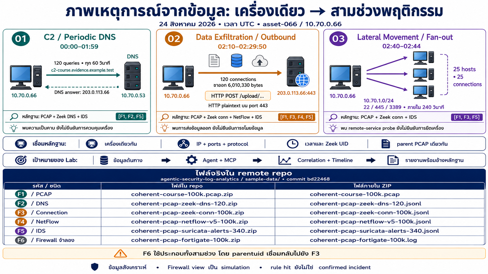

# ภาพเล่าเหตุการณ์สำหรับผู้เรียน

[กลับหน้าหลัก](https://github.com/aekanun2020/2026-Digital-Forensic/blob/3c7a24f7f09991dd78c4b2d6b24e1e841da95efb/student/agentic-siem/README.md) · [อ่าน records ที่รองรับภาพ](https://github.com/aekanun2020/2026-Digital-Forensic/blob/3c7a24f7f09991dd78c4b2d6b24e1e841da95efb/student/agentic-siem/INCIDENT-STORY.md)

## ชื่อไฟล์จริงตามรหัสในภาพ

ไฟล์ใน remote repo อยู่ใต้ [sample-data ของต้นทาง](https://github.com/aekanun2020/agentic-security-log-analytics/tree/bd22468e80f0481c85549266656cfa10faba7879/sample-data) และเก็บเป็น ZIP ตารางนี้แยกชื่อ archive ที่เปิดจาก GitHub ได้ออกจากชื่อไฟล์ภายใน ไม่สร้างลิงก์ไปยังไฟล์ที่ยังไม่ได้แตก ZIP

| รหัส | ชนิด / ช่วงในภาพ | Archive ใน remote repo ต้นทาง | ไฟล์ภายใน ZIP | สำเนาใน repo นักเรียน |
|---|---|---|---|---|
| F1 | PCAP ต้นทาง — ทุกช่วง | [coherent-course-100k.pcap.zip](https://github.com/aekanun2020/agentic-security-log-analytics/blob/bd22468e80f0481c85549266656cfa10faba7879/sample-data/coherent-course-100k.pcap.zip) | `coherent-course-100k.pcap` | [เปิดสำเนา](https://github.com/aekanun2020/2026-Digital-Forensic/blob/3c7a24f7f09991dd78c4b2d6b24e1e841da95efb/student/agentic-siem/source/sample-data/coherent-course-100k.pcap.zip) |
| F2 | DNS — C2 / Periodic DNS | [coherent-pcap-zeek-dns-120.zip](https://github.com/aekanun2020/agentic-security-log-analytics/blob/bd22468e80f0481c85549266656cfa10faba7879/sample-data/coherent-pcap-zeek-dns-120.zip) | `coherent-pcap-zeek-dns-120.jsonl` | [เปิดสำเนา](https://github.com/aekanun2020/2026-Digital-Forensic/blob/3c7a24f7f09991dd78c4b2d6b24e1e841da95efb/student/agentic-siem/source/sample-data/coherent-pcap-zeek-dns-120.zip) |
| F3 | Connection — Outbound และ lateral; ใช้เชื่อม UID | [coherent-pcap-zeek-conn-100k.zip](https://github.com/aekanun2020/agentic-security-log-analytics/blob/bd22468e80f0481c85549266656cfa10faba7879/sample-data/coherent-pcap-zeek-conn-100k.zip) | `coherent-pcap-zeek-conn-100k.jsonl` | [เปิดสำเนา](https://github.com/aekanun2020/2026-Digital-Forensic/blob/3c7a24f7f09991dd78c4b2d6b24e1e841da95efb/student/agentic-siem/source/sample-data/coherent-pcap-zeek-conn-100k.zip) |
| F4 | NetFlow — Outbound / Exfiltration | [coherent-pcap-netflow-v5-100k.zip](https://github.com/aekanun2020/agentic-security-log-analytics/blob/bd22468e80f0481c85549266656cfa10faba7879/sample-data/coherent-pcap-netflow-v5-100k.zip) | `coherent-pcap-netflow-v5-100k.jsonl` | [เปิดสำเนา](https://github.com/aekanun2020/2026-Digital-Forensic/blob/3c7a24f7f09991dd78c4b2d6b24e1e841da95efb/student/agentic-siem/source/sample-data/coherent-pcap-netflow-v5-100k.zip) |
| F5 | IDS — ทั้งสามช่วงตามกฎที่กำหนด | [coherent-pcap-suricata-alerts-340.zip](https://github.com/aekanun2020/agentic-security-log-analytics/blob/bd22468e80f0481c85549266656cfa10faba7879/sample-data/coherent-pcap-suricata-alerts-340.zip) | `coherent-pcap-suricata-alerts-340.jsonl` | [เปิดสำเนา](https://github.com/aekanun2020/2026-Digital-Forensic/blob/3c7a24f7f09991dd78c4b2d6b24e1e841da95efb/student/agentic-siem/source/sample-data/coherent-pcap-suricata-alerts-340.zip) |
| F6 | Firewall จำลอง — ประกอบทั้งสามช่วงด้วย parentuid ที่ผูกกับ F3 | [coherent-pcap-fortigate-100k.zip](https://github.com/aekanun2020/agentic-security-log-analytics/blob/bd22468e80f0481c85549266656cfa10faba7879/sample-data/coherent-pcap-fortigate-100k.zip) | `coherent-pcap-fortigate-100k.log` | [เปิดสำเนา](https://github.com/aekanun2020/2026-Digital-Forensic/blob/3c7a24f7f09991dd78c4b2d6b24e1e841da95efb/student/agentic-siem/source/sample-data/coherent-pcap-fortigate-100k.zip) |

การอ่านรหัสตามภาพ:

- **01 C2 / Periodic DNS:** F1 + F2 + F5
- **02 Data Exfiltration / Outbound:** F1 + F3 + F4 + F5
- **03 Lateral Movement / Fan-out:** F1 + F3 + F5
- **F6 เป็นข้อมูลประกอบที่จำลองขึ้น:** เชื่อมกับ F3 ด้วย `parentuid`; ไม่ใช่ผลสังเกตจาก firewall appliance จริง

ไฟล์เดียวอาจมีหลายช่วงพฤติกรรม ต้องใช้ IP, ports, protocol, เวลา และ UID เลือก records ที่เกี่ยวข้อง ไม่ถือว่าแต่ละไฟล์แทนการโจมตีชนิดเดียว F1 เป็น packet capture ส่วน F2–F6 เป็นข้อมูลจากหรือเกี่ยวเนื่องกับ parent เดียวกัน

ภาพนี้จัดวางเป็นแนวนอน 16:9 เพื่อให้แผงเหตุการณ์และชื่อไฟล์อ่านได้ชัดเจน จัดทำด้วย imagegen วันที่ 8 กันยายน 2026 จากข้อมูลที่ตรวจใน source commit `bd22468e80f0481c85549266656cfa10faba7879` เป็นภาพประกอบการเรียน ไม่ใช่ screenshot ของระบบหรือผลรันใหม่ ใช้เวลา UTC ของ scenario วันที่ 24 สิงหาคม 2026

อ่านจากซ้ายไปขวาเป็นสามช่วงพฤติกรรมของเครื่องเดียวกัน ลูกศรระหว่างช่องแสดงลำดับเวลา ส่วนแถบล่างแสดงเป้าหมายของ Lab: ข้อมูลต้นทาง → Agent + MCP → Correlation + Timeline → รายงานพร้อมอ้างหลักฐาน

- C2 / Periodic DNS: 120 queries ทุก 60 วินาที, 00:00–01:59, DNS answer `203.0.113.66`
- Data Exfiltration / Outbound: 120 connections และขาออก 6,010,330 bytes, 02:10–02:29:50; payload เป็น HTTP plaintext บน port 443
- Lateral Movement / Fan-out: 25 hosts, 25 connections ผ่าน ports 22/445/3389 ใน 240 วินาที, 02:40–02:44; payload เป็น remote-service probe

ชื่อหัวข้อเป็นมุมการวิเคราะห์ตามโจทย์ ภาพไม่ได้ยืนยัน compromise, การขโมยข้อมูล หรือการควบคุมเครื่อง และแถบเป้าหมายไม่ใช่หลักฐานว่ารัน agent ครบสายสำเร็จแล้ว ข้อจำกัดทางข้อมูลยังอ่านได้ใน [รายละเอียดการตรวจ](https://github.com/aekanun2020/2026-Digital-Forensic/blob/3c7a24f7f09991dd78c4b2d6b24e1e841da95efb/student/agentic-siem/WORKED-EVIDENCE.md)

ที่มา: [raw facts](https://github.com/aekanun2020/2026-Digital-Forensic/blob/3c7a24f7f09991dd78c4b2d6b24e1e841da95efb/student/agentic-siem/review/fixture-facts.json), [การจับคู่ข้าม views](https://github.com/aekanun2020/2026-Digital-Forensic/blob/3c7a24f7f09991dd78c4b2d6b24e1e841da95efb/student/agentic-siem/review/view-correlation.json), [manifest ข้อมูลต้นทาง](https://github.com/aekanun2020/2026-Digital-Forensic/blob/3c7a24f7f09991dd78c4b2d6b24e1e841da95efb/student/agentic-siem/source/sample-data/coherent-pcap-evidence.manifest.json)

## ที่มาของสำเนาในโครงการนี้

คัดลอกจาก [README ต้นทาง ณ commit `3c7a24f7f09991dd78c4b2d6b24e1e841da95efb`](https://github.com/aekanun2020/2026-Digital-Forensic/blob/3c7a24f7f09991dd78c4b2d6b24e1e841da95efb/student/agentic-siem/images/README.md) พร้อมภาพต้นฉบับ โดยปรับเฉพาะลิงก์ไปยังเอกสารประกอบให้เปิดต้นทางที่ตรึง commit ไว้ ภาพยังคงข้อความเดิม รวมถึงจุดที่ Codex เสนอให้แก้ไขใน [บันทึก Q&A](../../../Q&A/2026-09-08-nf01-incident-image-review.md)

[กลับสารบัญโจทย์ 01](../README.md) · [กลับหน้าหลักโครงการ](../../../README.md)
